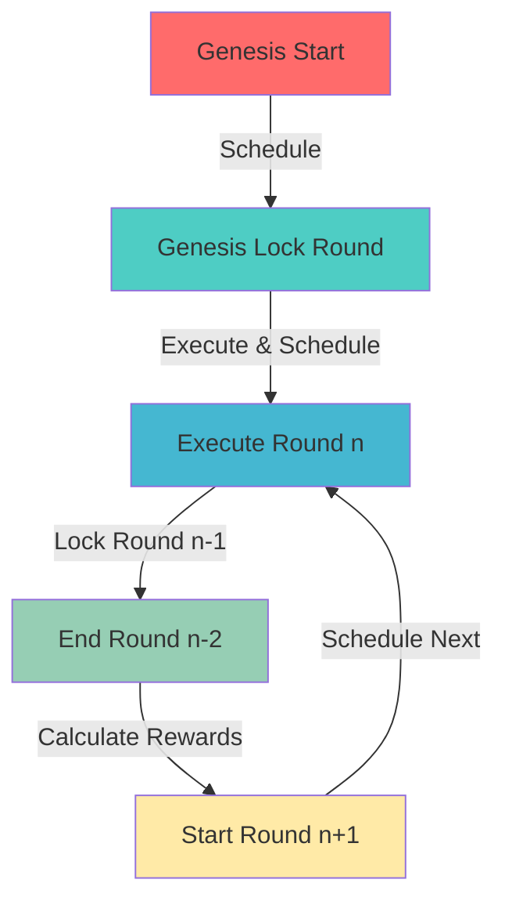

# 🔮 Massa Prediction Market

> **A Fully Autonomous Prediction Market Powered by Massa's Deferred Calls**

[](https://massa.net)
[](https://docs.massa.net)
[](https://dusa.io)

## 🌟 Overview

Massa Prediction Market is a **fully autonomous** decentralized prediction market built on the Massa blockchain. Users can predict whether the MAS/USDC price will go **UP (BULL)** or **DOWN (BEAR)** in timed rounds and earn rewards for correct predictions.

### 🎯 What Makes This Special?

This project showcases **Massa's unique autonomous smart contract capabilities** through:

- **🤖 Self-Executing Rounds**: The contract autonomously executes prediction rounds without any external intervention
- **⏰ Deferred Calls**: Leverages Massa's native deferred call system to schedule future executions
- **🔄 Perpetual Operation**: Once started, the market runs indefinitely, scheduling its own future operations
- **📊 Oracle-Free Price Feeds**: Integrates with Dusa DEX for real-time, trustless price data
- **💰 Automated Reward Distribution**: Calculates and distributes rewards automatically based on round outcomes

---

## 🏗️ Architecture

### Smart Contract (AssemblyScript)

The prediction market contract is built with **AssemblyScript** and deployed on Massa blockchain. It demonstrates advanced autonomous capabilities:

#### 🔑 Key Features

1. **Autonomous Round Execution**

   - Rounds execute automatically at configured intervals
   - No external keeper or bot required
   - Self-scheduling through Massa's deferred calls

2. **Three-Phase Round System**

   ```
   Round n-2: ENDED → Calculate rewards
   Round n-1: LOCKED → Price locked, no new bets
   Round n:   LIVE → Users can place bets
   ```

3. **Dusa DEX Integration**

   - Fetches real-time MAS/USDC prices from Dusa liquidity pools
   - Uses bin-based pricing mechanism for accurate price discovery
   - No centralized oracle dependency

4. **Security Features**
   - Reentrancy protection
   - Owner-only administrative functions
   - Pausable contract for emergency situations
   - Buffer period to prevent last-second manipulation

---

## 🚀 How Massa Deferred Calls Power Autonomy

### The Innovation: Self-Scheduling Smart Contracts

Traditional blockchain prediction markets require external bots or keepers to trigger round transitions. **Massa's deferred calls eliminate this dependency entirely.**

### 🔄 Autonomous Execution Flow



### 📋 Implementation Details

#### 1. **Scheduling Genesis Lock Round**

```typescript
function _scheduleGenesisLockRound(): void {
  const intervalSeconds = bytesToU64(Storage.get(INTERVALS_SECONDS_KEY)) / 1000;
  const genesisLockRoundArgs = new Args().serialize();
  const maxGas = 900_000_000;

  // Find the cheapest slot for execution
  const slot = findCheapestSlot(
    bookingPeriod,
    bookingPeriod + 5,
    maxGas,
    paramsSize
  );
  const cost = deferredCallQuote(slot, maxGas, paramsSize);

  // Register the deferred call
  const callId = deferredCallRegister(
    Context.callee().toString(),
    "genesisLockRound",
    slot,
    maxGas,
    genesisLockRoundArgs,
    0
  );
}
```

#### 2. **Self-Perpetuating Round Execution**

```typescript
export function executeRound(_: StaticArray<u8>): void {
  _onlyOwnerOrCallee(); // Only contract itself can call

  const currentPrice = _getTokenPrice();
  let currentEpoch = bytesToU64(Storage.get(CURRENT_EPOCH_KEY));

  _safeLockRound(currentEpoch, currentPrice); // Lock round n-1
  _safeEndRound(prevEpoch, currentPrice); // End round n-2
  _calculateRewards(prevEpoch); // Calculate rewards
  _safeStartRound(currentEpoch + 1); // Start round n

  _scheduleNextRound(); // 🔄 Schedule the next execution!
}
```

#### 3. **Dynamic Slot Selection**

The contract intelligently finds the cheapest execution slot:

```typescript
const slot = findCheapestSlot(
  bookingPeriod,
  bookingPeriod + 5, // 5-period window for flexibility
  maxGas,
  paramsSize
);
```

### 💡 Why This Matters

| Traditional Approach               | Massa Deferred Calls         |
| ---------------------------------- | ---------------------------- |
| ❌ Requires external bots          | ✅ Fully autonomous          |
| ❌ Single point of failure         | ✅ Decentralized execution   |
| ❌ Additional infrastructure costs | ✅ Native blockchain feature |
| ❌ Bot maintenance overhead        | ✅ Self-maintaining          |
| ❌ Potential downtime              | ✅ Guaranteed execution      |

---

## 🎮 Core Contract Functions

### User Functions

- **`betBull(epoch, amount)`** - Bet that price will go UP
- **`betBear(epoch, amount)`** - Bet that price will go DOWN
- **`claim(epochs[])`** - Claim rewards for winning predictions
- **`getUserRounds(user, cursor, size)`** - Get user's betting history

### Autonomous Functions (Self-Called)

- **`genesisStartRound()`** - Initialize the first round
- **`genesisLockRound()`** - Lock genesis round (auto-scheduled)
- **`executeRound()`** - Execute round transitions (auto-scheduled)

### Administrative Functions

- **`pause()`** / **`unpause()`** - Emergency controls
- **`pauseAutomation()`** - Stop automatic scheduling
- **`setTreasuryFee()`** - Adjust platform fee
- **`claimTreasury()`** - Withdraw accumulated fees

---

## 🔗 Dusa DEX Integration

### Oracle-Free Price Feeds

Instead of relying on centralized oracles (which don't exist on Massa yet), we leverage **Dusa DEX** as a decentralized price source:

```typescript
function _getTokenPrice(): u64 {
  const poolAddress = Storage.get(POOL_ADDRESS_KEY);
  const poolContract = new IDusaPair(new Address(poolAddress));
  const pairInfo = poolContract.getPairInformation();

  return BinHelper.getPriceFromId(
    pairInfo.activeId as u64,
    bytesToU32(Storage.get(POOL_BIN_STEP_KEY)) as u64
  ).toU64();
}
```

### How It Works

1. **Liquidity Pool**: Connects to MAS/USDC pool on Dusa DEX
2. **Active Bin ID**: Fetches the current active trading bin
3. **Price Calculation**: Converts bin ID to actual price using mathematical formula
4. **Trustless**: No centralized oracle, price comes directly from DEX liquidity

---

## 💰 Reward Mechanism

### Calculation Logic

```typescript
function _calculateRewards(epoch: u64): void {
  const round = roundsMap.getSome(epoch);
  const treasuryFee = bytesToU32(Storage.get(TREASURY_FEE_KEY));

  if (round.closePrice > round.lockPrice) {
    // BULL wins
    rewardBaseCalAmount = round.bullAmount;
    treasuryAmt = (round.totalAmount * treasuryFee) / 10000;
    rewardAmount = round.totalAmount - treasuryAmt;
  } else if (round.closePrice < round.lockPrice) {
    // BEAR wins
    rewardBaseCalAmount = round.bearAmount;
    // ... same calculation
  }
}
```

### Payout Formula

```
User Reward = (User Bet Amount / Winning Side Total) × Total Reward Pool
```

Where:

- **Total Reward Pool** = Total Bets - Treasury Fee (10%)
- **Winning Side** = Bull or Bear (whichever predicted correctly)

---

## 🎨 Frontend (React + TypeScript)

### Features

- 🔌 **Massa Wallet Integration** - Connect with Massa Station or Bearby
- 📊 **Live Round Display** - See current, next, and past rounds
- 💸 **One-Click Betting** - Place BULL or BEAR bets instantly
- 🏆 **Reward Claiming** - Claim winnings from multiple rounds
- ⚡ **Real-Time Updates** - Auto-refresh round status
- 📱 **Responsive Design** - Works on desktop and mobile

### Tech Stack

- **React 18** with TypeScript
- **Vite** for blazing-fast development
- **TailwindCSS** for styling
- **@massalabs/massa-web3** for blockchain interaction
- **@massalabs/react-ui-kit** for wallet connection

---

## 🛠️ Installation & Setup

### Prerequisites

- Node.js 18+
- npm or yarn
- Massa wallet with testnet MAS

### 1. Clone Repository

```bash
git clone https://github.com/yourusername/massa-prediction-market.git
cd massa-prediction-market
```

### 2. Install Dependencies

```bash
# Install contract dependencies
cd contracts
npm install

# Install frontend dependencies
cd ../frontend
npm install
```

### 3. Configure Environment

Create `.env` file in `contracts/` directory:

```env
WALLET_SECRET_KEY=your_secret_key_here
JSON_RPC_URL_PUBLIC=https://buildnet.massa.net/api/v2
```

### 4. Build & Deploy Contract

```bash
cd contracts
npm run build
npm run deploy
```

### 5. Update Contract Address

Copy the deployed contract address and update `frontend/src/lib/const.ts`:

```typescript
export const CONTRACT_ADDRESS = "AS12..."; // Your deployed address
```

### 6. Run Frontend

```bash
cd frontend
npm run dev
```

Visit `http://localhost:5173` 🎉

---

## 📦 Project Structure

```
massa-prediction-market/
├── contracts/
│   ├── assembly/
│   │   └── contracts/
│   │       ├── main.ts              # Main prediction market contract
│   │       ├── interfaces/
│   │       │   └── IDusaPair.ts     # Dusa DEX interface
│   │       ├── lib/
│   │       │   ├── dusaBinHelper.ts # Price calculation utilities
│   │       │   ├── ownership.ts     # Access control
│   │       │   └── ReentrancyGuard.ts
│   │       └── structs/
│   │           ├── round.ts         # Round data structure
│   │           └── betInfo.ts       # Bet information
│   ├── src/
│   │   ├── deploy.ts               # Deployment script
│   │   └── calls.ts                # Contract interaction helpers
│   └── package.json
│
└── frontend/
    ├── src/
    │   ├── components/
    │   │   ├── RoundCard.tsx       # Round display component
    │   │   └── AppLayout.tsx       # Main layout
    │   ├── pages/
    │   │   ├── Home.tsx            # Main prediction interface
    │   │   └── Admin.tsx           # Admin controls
    │   ├── lib/
    │   │   ├── massa.ts            # Blockchain interactions
    │   │   └── const.ts            # Configuration constants
    │   └── App.tsx
    └── package.json
```

---

## 🎯 Hackathon Highlights

### Innovation

✨ **First fully autonomous prediction market on Massa**

- Zero external dependencies for operation
- Self-scheduling through deferred calls
- Perpetual operation without human intervention

### Technical Excellence

🔧 **Advanced Massa Features**

- Deferred call scheduling and management
- Cross-contract calls to Dusa DEX
- Complex state management with persistent maps
- Gas optimization for autonomous execution

### User Experience

🎨 **Intuitive Interface**

- Clean, modern design
- Real-time round updates
- Seamless wallet integration
- Mobile-responsive layout

### DeFi Integration

🔗 **Ecosystem Collaboration**

- Integrates with Dusa DEX for price feeds
- Demonstrates composability on Massa
- Oracle-free architecture

---

## 🙏 Acknowledgments

- **Massa Labs** - For the innovative autonomous smart contract platform
- **Dusa DEX** - For providing decentralized liquidity and price feeds
- **Massa Community** - For support and feedback

---

<div align="center">

**Built with ❤️ for Massa Hackathon**

_Showcasing the power of autonomous smart contracts_

</div>
